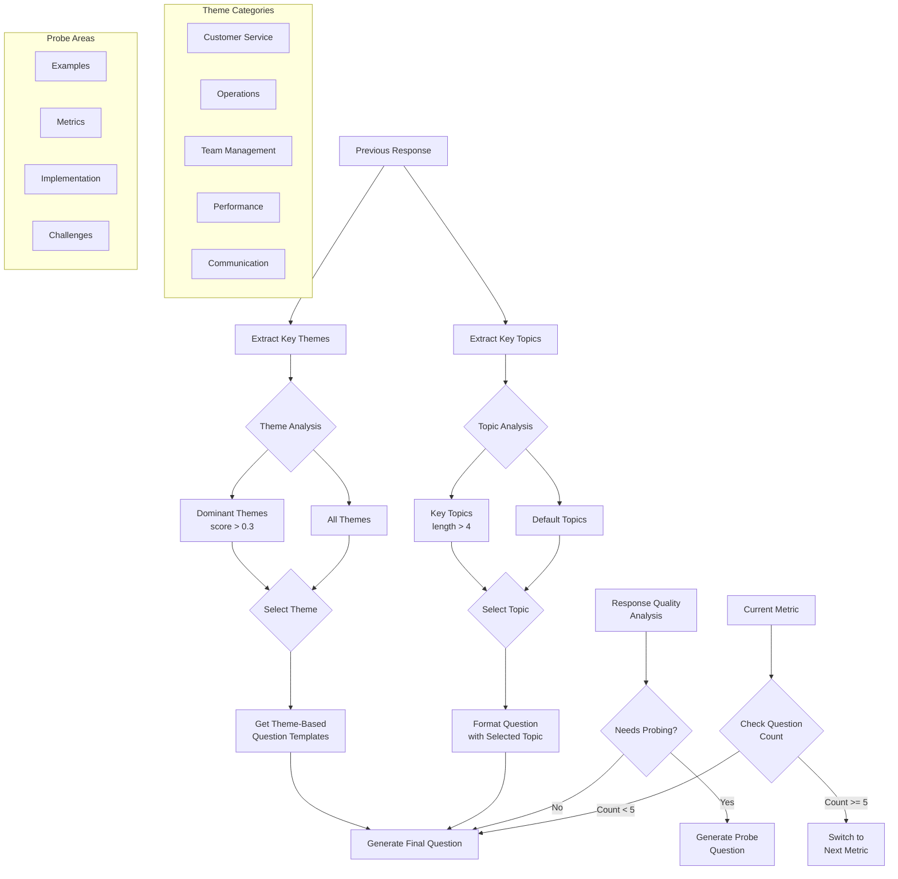

# Role Play Assessment CLI

A command-line interface (CLI) application for conducting role-play assessments using TinyLlama for dynamic question generation and evaluation.

## Overview

This CLI application helps evaluate communication and engagement competencies through role-play scenarios. It:
- Uses TinyLlama to generate contextual questions
- Conducts an interactive assessment with dynamic follow-up questions
- Evaluates responses in real-time
- Provides detailed scoring and feedback for each competency

## Project Structure

```
project/
│
├── metrics.json               # Evaluation criteria and scoring details
├── case_doc_latest.json      # Case document with scenario and role details
├── main.py                   # Main entry point for the CLI
├── llm_handler.py            # Module for LLM interactions
├── utils.py                  # Utility functions
└── README.md                 # Documentation
```

## Requirements

- Python 3.6 or higher
- Ollama with TinyLlama model installed
- Python packages:
  - requests

## Installation

1. Clone this repository
2. Create and activate a virtual environment:
```bash
python3 -m venv venv
source venv/bin/activate
```
3. Install dependencies:
```bash
pip install requests
```
4. Ensure Ollama is running with TinyLlama model:
```bash
ollama run tinyllama
```

## Usage

1. Activate the virtual environment:
```bash
source venv/bin/activate
```

2. Run the assessment:
```bash
python main.py
```

The CLI will:
1. Display the scenario and instructions
2. Start with an initial question about case understanding
3. Generate follow-up questions based on your responses
4. Evaluate responses in real-time
5. Provide comprehensive feedback and scores

## Assessment Structure

The assessment evaluates three key aspects:
1. Clear Communication
2. Engaging Discussions
3. Active Engagement

For each aspect:
- 5 dynamically generated questions
- Real-time evaluation of responses
- Scores on a scale of 1.0 to 4.0:
  - 1.0: Needs significant improvement
  - 2.0: Basic competency
  - 3.0: Proficient
  - 4.0: Exceptional

## Question Generation Flow



## Key Features

1. **Theme-Based Question Generation**
   - Extracts key themes from responses (customer service, operations, team management, etc.)
   - Scores theme relevance based on keyword matching
   - Selects dominant themes for follow-up questions

2. **Topic Extraction**
   - Identifies specific topics from responses
   - Filters common words and short terms
   - Maintains context between questions

3. **Response Quality Analysis**
   - Validates response length and content
   - Identifies areas needing clarification
   - Triggers probing questions when needed

4. **Metric-Based Assessment**
   - Tracks progress through different metrics
   - Ensures comprehensive coverage of all aspects
   - Adapts questions to metric context

## Question Types

1. **Initial Case Understanding**
   - Open-ended questions about the case
   - Focus on overall comprehension

2. **Theme-Based Follow-ups**
   - Questions based on previous response themes
   - Maintains conversation continuity

3. **Probing Questions**
   - Triggered by incomplete responses
   - Seeks specific examples or clarification
   - Limited to prevent excessive probing

4. **Metric-Specific Questions**
   - Tailored to current assessment metric
   - Uses appropriate templates for context

## Files Description

- `main.py`: Entry point for the CLI application
- `llm_handler.py`: Manages interactions with TinyLlama for question generation and evaluation
- `utils.py`: Contains utility functions
- `metrics.json`: Defines evaluation criteria and scoring
- `case_doc_latest.json`: Contains the case scenario and roles

## Contributing

1. Fork the repository
2. Create a feature branch
3. Commit your changes
4. Push to the branch
5. Create a Pull Request
